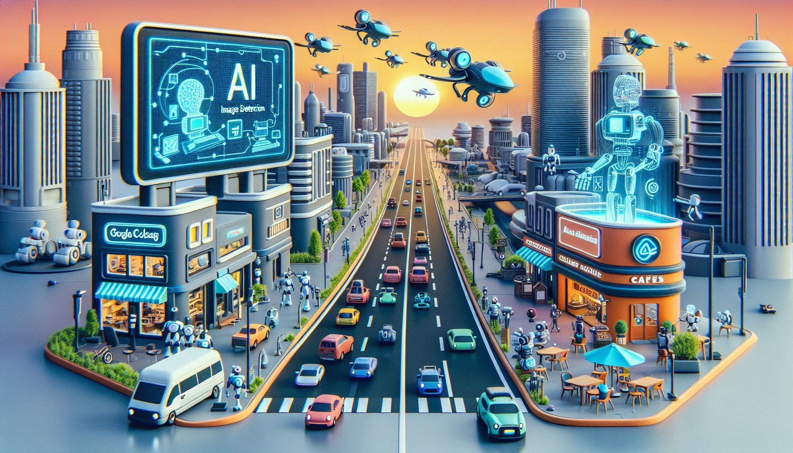
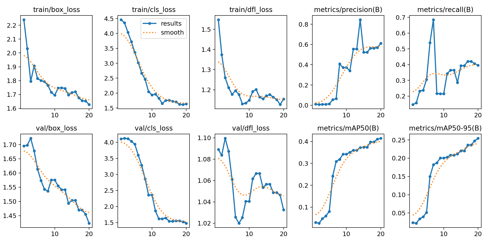
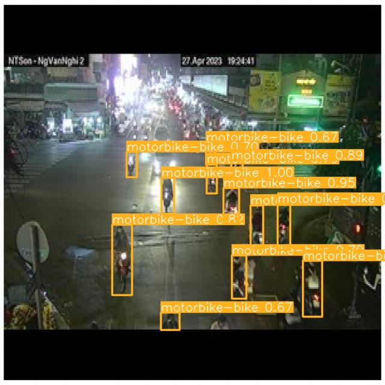

## Simple Projects using Google Colab

- Project 1: Instance Segmentation using Detectron2
  

  
- Project 2: Video segmentation and detection using YOLO8
  
  
  
- Project 3: Fine turning a LLM
- Project 4: Mean reversion
- Project 5: Pair trading

